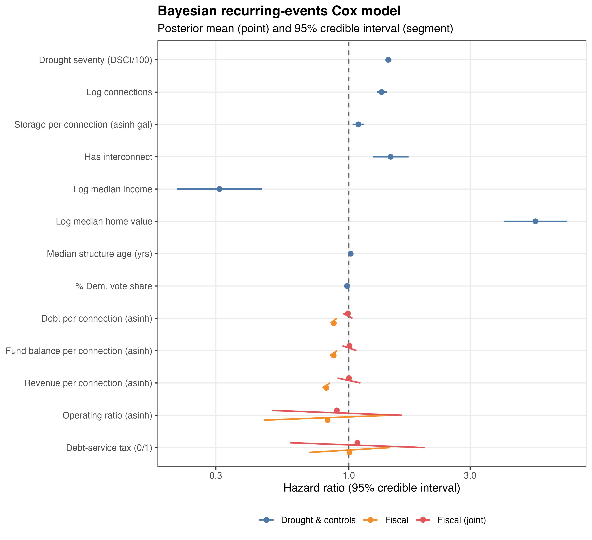

<!-- =====================================================================
     WORKFLOW NOTE (delete before submission)
     - This .qmd is the SOURCE of truth. Render to manuscript.md / .docx:
         quarto render paper/manuscript.qmd
     - Every number comes from output/*.csv via the _setup.R helpers, e.g.
         613   scalar prose fact
         -0.14 (95% CrI: -0.16, -0.11) coefficient + 95% CrI
         1.42 (95% CrI: 1.38, 1.46)      hazard ratio + 95% CrI
     - Tables are generated by chunks calling results_table() etc.
     - Blocks marked  <!-- STALE (step 2): ... -->  describe the OLD model
       (KBDI, monthly 2011-2016, BYM/ICAR spatial, debt-service-tax Fig 6,
       time-to-first-adoption) and must be rewritten for the current spec:
       weekly 2010-2025, DSCI, two iid frailties (district + county, no ICAR),
       repeated events, 730-day/FY-end-date audit rule, wholesaler control,
       dropped demographics/consumption/operating-ratio/debt-service-tax.
     ===================================================================== -->

**Tradeoffs Across Fiscal Capacity and Environmental Crisis Management** 

#### **Abstract**

The safety, reliability, and equity of public service provision often depend on how and when public managers respond to disruptive events. When crises warrant service reductions, providers potentially face competing pressures, such as the need to limit consumption while still funding critical operations and fulfilling financial obligations. This paper uses the case of water use restrictions adopted by water utilities under severe drought conditions to examine how fiscal capacity relates to emergency response. The political economy of local water services in the United States requires individual community water systems to consider both environmental sustainability and fiscal sustainability goals. During an environmental crisis, such as an extreme drought, these goals may be competing and there are tradeoffs between the conservation of water and fiscal solvency. Using a multilevel, joint likelihood model specification, we regress adoption and time-to-adoption on financial data for special water districts in the state of Texas during periods of severe drought. Preliminary results suggest that water utilities prioritize environmental management and follow their drought management plans even when faced with limited financial resources. Ultimately, both high-resource and low-resource water districts adopt timing drought restrictions. 

\*All data and materials needed for replication are available upon request

1. # **INTRODUCTION**

The ability of public managers and other service providers to respond to disruptive events and changing service pressures is key for ensuring the safe, reliable, and equitable provision of public goods and services [(Hood 1991; Boin and van Eeten 2013; Comfort 2005\)](https://paperpile.com/c/kCIXNA/Arld+WDY9+qOF8). Studies have shown that institutional constraints and political incentives attenuate when and how local utilities innovate, conserve resources, and respond to environmental and regulatory pressures [(Teodoro 2009; Konisky and Teodoro 2016; Mullin and Rubado 2017; Teodoro, Zhang, and Switzer 2018\)](https://paperpile.com/c/kCIXNA/irGCF+Z2h3+ioyIM+HiQr). However, public administrators do not operate solely in the realm of political economy--public service delivery choices are also driven by practical constraints such as access to skilled labor [(Teodoro and Switzer 2016\)](https://paperpile.com/c/kCIXNA/erVlb) and the ability to access and deploy financing tools [(Scott, Moldogaziev, and Greer 2018\)](https://paperpile.com/c/kCIXNA/mHWGa).  
This paper considers the tension between fiscal capacity and emergency management in public service delivery, focusing on the case of drinking water provision under severe drought conditions. Capital intensity is a major implementation challenge for water service delivery. Providers typically finance major capital investments with tax- and/or revenue-backed bond issues. Providers are then reliant upon incoming service fees or property taxes both to conduct ongoing operations and maintenance and to pay off creditors. In the case of a drought, this creates tension between the need to cut back on water use to preserve dwindling supplies and the need to maintain sufficient inflow of funds, which has sometimes been referred to as a “conservation conundrum” [(Beecher 2010\)](https://paperpile.com/c/kCIXNA/21t5O). Thus, water providers’ lack of fiscal capacity is a potential inhibitor of crisis management.  
To test hypotheses relating to these barriers, we use a multilevel Cox proportional hazards model for repeated events that models the adoption of water use restrictions on a weekly basis from 2010 to 2025 as a function of environmental conditions, institutional attributes, and provider finances. 

2. # **CRISIS MANAGEMENT AS A PUBLIC MANAGEMENT AND PUBLIC FINANCE PROBLEM**

The choices public managers face in times of crisis are commonly situated at the nexus of problem conditions, institutional capacity, technical capacity and political interests [(Mullin and Rubado 2017; Teodoro et al. 2018; Giordono et al. 2021\)](https://paperpile.com/c/kCIXNA/ioyIM+HiQr+N3h7). For instance, in the case of water service delivery, mandatory restrictions on service consumption can alleviate a supply problem, but create controversy and erode political capital. In this framing, problem condition refers to water supplies and drought severity, institutional capacity is the ability to implement preferred actions, technical capacity is the response capacity of the infrastructure system itself (e.g., storage, interconnections, etc.), and political interests refer to the preferences of interest groups and service recipients who might favor or oppose a given course of action. As an example of how these factors intersect, Mullin and Rubado [(2017)](https://paperpile.com/c/kCIXNA/ioyIM/?noauthor=1) analyze time-to-adoption for around 300 water utilities that adopted a mandatory water use restriction between 2010 and 2013 during a severe drought in Texas and find that problem conditions and institutional/technical capacity outweigh political concerns as key drivers of adoption.[^1]   
In this paper, we extend this crisis management framework (problem conditions, institutional capacity, technical capacity, political considerations) by incorporating a fifth conceptual driver of manager decision-making: *fiscal capacity*.[^2] Fiscal capacity is the ability of a public service provider to extract revenues and fulfill service obligations, while meeting financial commitments. In other words, it is the ability to access funds necessary to operate, take necessary actions, and pay off debts. Fiscal capacity--or lack thereof--has been shown to drive a variety of public management decisions including consolidation [(Mughan 2019\)](https://paperpile.com/c/kCIXNA/zTeJ), special district creation [(Eger 2006; Mullin 2010\)](https://paperpile.com/c/kCIXNA/nNqY+CUFr), public-private partnerships [(Tan and Zhao 2019\)](https://paperpile.com/c/kCIXNA/0Xhp), and contracting [(Brown and Potoski 2003\)](https://paperpile.com/c/kCIXNA/vItT).   
	However, outside of a voluminous literature on actual fiscal crises, the role of fiscal constraints in shaping service provision management during a crisis has not been extensively considered. Financial barriers and fiscal constraints are recognized as a key factor in local government’s *disaster response* [(e.g., Hildreth 2009; Simo and Bies 2007\)](https://paperpile.com/c/kCIXNA/N7AB+pcKj/?prefix=e.g.%2C,), but disaster response and *crisis management* are different concepts. Crisis management is defined as “ a systematic attempt by organizational members… to avert crises or to effectively manage those that do occur” [(Pearson and Clair 1998, 68\)](https://paperpile.com/c/kCIXNA/F0wc/?locator=68). That is, crisis management encompasses not just post-disaster response but also the decisions public managers make to recognize, assess, and respond to emerging problems [(Boin et al. 2016\)](https://paperpile.com/c/kCIXNA/Cwsc). In the case of drought, for instance, crisis management thus refers not just to what utilities do when water runs out but also how they respond to dwindling supplies and potential shortfalls.  
We expect that the role of fiscal capacity in shaping crisis management decisions is particularly pronounced for service delivery tasks such as drinking water provision, which has highly specialized and capital-intensive infrastructure requirements [(Mullin 2009\)](https://paperpile.com/c/kCIXNA/kR0Qi). Drinking water providers rely on a combination of tax revenue, service fees, and debt issuance to fund ongoing operations and maintenance and finance new capital projects. When revenues are tied to water consumption, as is common with a user-fees and charges revenue model, then conservation policies adopted during a drought or other supply crisis that reduce money coming can come into conflict with a provider’s need to fund service provision and pay off creditors. Thus, we hypothesize that providers with lower, or more strained, fiscal capacity will be slower and less likely to adopt water use restrictions that reduce revenue; conversely, utilities with higher fiscal capacity will be better positioned to be more risk averse in crisis management and adopt water use restrictions more quickly, all else equal.

# **3\. CASE BACKGROUND**

We test the link between fiscal capacity and crisis management behavior using public water restriction notices and yearly financial records obtained for special water districts in Texas from 2010 to 2025\. Special water districts in Texas offer several advantages for testing the relationship between financial capacity and water restrictions. First, district-level water service provision in Texas is highly fragmented, producing a large sample size. Over the 2010- 2025 observation period, we observe 613 special water districts acting as retail drinking water suppliers.   
Second, the simpler administrative structure of special water districts, relative to city-owned water utilities nested within a general purpose government, offers a cleaner financial comparison. General-purpose local governments typically set up their water utilities as independent proprietary funds, but during emergencies they may be able to transfer general funds to the water utility fund. The fungibility of general funds make organizational debt levels and fiscal capacity difficult to compare across all government types. Cities also have more complex debt service obligations, some of which may fall under the water utility fund and some which may not.   
Third, special water districts are highly active in credit markets. In the early 20th century, the Texas Constitution authorized a variety of water districts to have unlimited bond indebtedness to meet demand through a variety of services such as supply, storage, and water quality improvement for agricultural lands, new developments, and industry [(Allen and Oliver 2009; TCEQ 2018\)](https://paperpile.com/c/kCIXNA/hXnyr+x1ePr). The Texas Water Development Board (TWDB) has also offered grants and loans for ongoing development of water infrastructure and for water-quality improvement [(TWDB 2018b)](https://paperpile.com/c/kCIXNA/DErvu). For example, the 2013 State Water Implementation Fund for Texas (SWIFT) and the 2001 State Water Implementation Revenue Fund for Texas (SWIRFT) provide communities with low-interest loans, extended repayment terms, deferral of loan repayments, and incremental repurchase terms for projects with state ownership [(TWDB 2018c)](https://paperpile.com/c/kCIXNA/mayM). Authorized by the SDWA, the Drinking Water State Revolving Fund (DWSRF) Loan Program offers assistance to water utilities that need to respond to unanticipated, drought-related reduction in adequate water supply [(TWDB 2018a)](https://paperpile.com/c/kCIXNA/8HPn4). Further, the Texas Water Development Fund provides loans to water suppliers for efforts to improve aspects relating to water supply, such as conservation and water quality enhancement [(TWDB 2018c)](https://paperpile.com/c/kCIXNA/mayM).   
Fourth, water providers in Texas frequently have to manage drought-driven water supply crises. In light of this persistent threat, the TWDB requires all community water systems to develop a drought contingency plan (DCP). A DCP identifies key indicators used to monitor drought and related water availability threats, benchmarks used to set system status, and steps that will be taken under different status designations. Retail water systems with more than 3,300 connections are required to submit their plan to the TCEQ for review; retail water systems with fewer than 3,300 service connections are required to prepare and adopt a DCP, but only need to provide the plan to the TCEQ upon request [(TCEQ 2019a)](https://paperpile.com/c/kCIXNA/9wAXh). When droughts hit and trigger a response stage, retail water suppliers must report DCP implementation within five business days of enactment [(TCEQ 2000\)](https://paperpile.com/c/kCIXNA/hJHlz). These restrictions can be voluntary (asking customers to limit water use) or mandatory, with obligatory restrictions falling into three categories: mild (e.g., calendar restrictions on outdoor watering), moderate (e.g., only handheld outdoor water usage), or severe (e.g., all outdoor water usage prohibited). 

# **4\. METHODS AND MATERIALS**

## **4.1 Sample: Special Water Districts in Texas**

There are many different types of special water districts in Texas. Water district types that we include in our focal sample are municipal utility districts (MUD), water control and improvement districts (WCID), special utility districts (SUD); fresh water supply districts (FWSD).[^3] While there are other classifications of water districts in Texas that sometimes operate as retail water providers, MUDs, SUDSs, WCIDs, and FWSDs are the most common and have similar institutional characteristics.[^4] Because these special districts generally operate at a neighborhood scale and almost always act as a drinking water provider in communities they serve, these units present a strong alignment between the community water system under regulation and the overarching institution responsible for financing and operations. Likewise, these districts generally share a consistent administrative leadership structure. The Texas Water Code requires each district to be governed by a board of directors. While there are certain limited circumstances where directors can be appointed (e..g, newly formed districts, vacancies), generally district residents directly elect board members (Texas Water Code § 49.051). Given the purpose of this analysis, this consistent administrative structure is useful for holding political incentives (roughly) constant and delving into the role of fiscal capacity. Thus, although the role of administrative structure (e.g., between municipalities, special districts, and private operators) in shaping crisis response is an important ongoing research agenda in its own right, we test hypotheses concerning water districts that differ in economic fortunes but which generally share a similar administrative design. Further, to account for potential unobserved differences between MUDs, WCIDs, SUDs, and FWSDs, we additionally use fixed effects for district type in all models.  
Counting the total population of community water systems (CWS)[^5] in Texas is a fluid number--over time systems activate and deactivate, consolidate with or split from other CWSs, and move into different regulatory categories. For our analysis, we focus on CWSs that fit four criteria: (1) owned by a municipal utility district (MUD), water control and improvement district (WCID), special utility district (SUD); or fresh water supply district (FWSD);  (2) active through the entirety of the observation period May 4, 2010 to December 31, 2025; (3) GIS data available showing service territory extent, which is necessary to compute demographic profiles and related data for each system; (4) an observed financial audit within two years prior to the start of the drought period. A total of 710 CWSs fit these criteria (Table 1), representing about 93% of all special district-owned CWSs[^6] we identify as being active during the observation period. Additionally, for fitting a baseline model to generate priors for the district-specific model, we draw upon a broader sample of 4230 CWSs of all ownership types that were active during the drought period and for which GIS data are available (96% of systems had GIS data).  
*Table 1: Comparison of counts and data availability between sample frame and total population of community water system in Texas*

| Sample | \# with observable data(% of total) | \# of adopters in sample (% of sample)  | Water use  restrictions | Operations data | Debt data | Budget data |
| :---- | ----- | ----- | ----- | ----- | ----- | ----- |
| All community water systems in Texas | 4230 (96%) | 899 (21%) | x | x |  |  |
| Special Water Districts (MUDs, FWSDs, SUDs, WCIDs)[^7] | 710 (93%)  | 132 (19%) | x | x | x | x |

## **4.2 Outcome Measure: Mandatory Water Use Restrictions**

The core outcome measure used in this analysis is CWS’ adoption of mandatory water use restrictions in response to drought. DCPs can also involve other interventions aside from mandatory restrictions, such as encouraging conservation with pricing strategies such as drought-specific surcharges. However, while drought pricing strategies represent an additional conservation measure that may be used in conjunction with mandatory restrictions, there are several additional factors that affect pricing-based curtailment including the rate structure (as opposed to level), rate awareness, and metering details [(Tiger, Hughes, and Eskaf 2014\)](https://paperpile.com/c/kCIXNA/U9QE). Moreover, the Public Utility Commission of Texas plays a role in approving retail water rates, meaning that individual providers do not always have full control of this mechanism.[^8] Restriction notice data were combined from several records: a historical spreadsheet provided by TWDB, webscraping archived versions of TWDB’s old drought notice postings webpage from the Internet Archive, and webscraping the modern TWDB drought notice page ([https://www.tceq.texas.gov/drinkingwater/trot/droughtw.html](https://www.tceq.texas.gov/drinkingwater/trot/droughtw.html)).   
We observe when a CWS notifies TWDB of a new restriction issuance, but not when a given restriction is rescinded. Some water districts adopted restrictions multiple times within the observation period. We treat each new mandatory restriction notice as a new restriction, and thus model restriction adoption by CWSs as a repeated events model. Across the 613 districts in the sample, 31% adopt at least one restriction during the observation period and 14% adopt at least two restrictions; the maximum number of restrictions adopted is 18. 

## **4.3 Crisis Measure: Drought Conditions**

The \~15 year observation period encompasses three water supply periods: (1) a severe drought lasting from mid 2010 to mid 2015 [(see NIDIS 2019\)](https://paperpile.com/c/kCIXNA/XWFs/?prefix=see); (2) a period of normal precipitation from mid 2015 to mid 2021; and (3) a second severe drought period from mid-2021 to mid-2025 (we extend the modeling to the end of 2025). The US National Drought Mitigation Center’s (NDMC) Drought Severity and Coverage Index (DSCI) [(NDMC 2019\)](https://paperpile.com/c/kCIXNA/EhikS) categorizes drought conditions by county into five categories: ‘abnormally dry’ (D0), found at the onset or end of a drought) and four stages of actual drought ranging from prospective water shortages (D1) to a water shortage emergency (D4). These values are converted into a DSCI severity score where the percentage of area in each level is multiplied by 1 (D0), 2 (D1), 3 (D2), 4 (D3) or 5 (D4) and the values are summed. The lowest possible value is 0 (0% area in drought) and the highest possible value is 500 (100% area in D4 level drought).   
	Not all water use restrictions are issued for drought response. For instance, a utility might experience equipment failure or source contamination that warrants a temporary restriction. But comparing the frequency distribution of restriction notices to changing DSCI severity measures demonstrates a correspondence between restriction notices and drought conditions (Figure FFF). Panel A in Figure FFF shows the average monthly DSCI by water district in the sample; Panel B shows the adoption of water use restrictions over this same time period.  
![][image1]  
*Figure 1\. Weekly Measures of the Drought Severity and Coverage Index in Texas, 2010-2025*

## 

## **4.4 Explanatory Variables: Fiscal Capacity Measures**

The concept of fiscal capacity has been operationalized in the literature using many different financial measures (Levine et al. 2012). Central to the definitional challenge are the tradeoffs that occur between revenue and expenditure decisions along with the intertemporal shifting of those tradeoffs by issuing debt. In the water district context this means tradeoffs between delivering water services (service-level) to customers while maintaining cash on hand for operations (short-term) and making debt payments (long-term solvency). We focus on three core fiscal capacity measures: (1) debt per-connection; (2) revenue per-connection;[^9] (3) fund balance (i.e., cash on hand) per-connection. If a provider is over-leveraged with a high level of debt outstanding, has less of a revenue cushion, or has fewer funds on hand that can be a short-term substitute for temporary cut-backs, water use restrictions that cut back on revenues can impact short-term or long-term solvency.[^10]    
Texas water districts are required to file an annual financial audit report with the TCEQ that details basic financial attributes--namely, revenue, expenditures, and assets.[^11] A separate agency, the Texas Bond Review Board (TBRB), maintains bond debt records for all public entities in the state. To measure total debt levels across utilities that have access to different revenue sources, we combine both general-obligation and revenue-backed debt into a single variable. TBRB does not record data using the same district identification codes as TCEQ. We match debt records to the other data sources using string matching to district names, combined with a good deal of hand cleaning to make the names match appropriately. We exclude districts that are not able to be matched to audit data.  
To account for both the wide-tailed distribution of financial values (e.g., some districts have a lot of debt) and the presence of zero (no debt) or negative (negative fund balance) values in the data, we apply an inverse hyperbolic sine (IHS) transformation to these variables [(Burbidge et al. 1988\)](https://paperpile.com/c/kCIXNA/nqsM). The IHS transformation approximates a logarithmic transformation, but does not perform identically. When using the IHS transformation for explanatory variables, elasticity estimates can differ (versus logarithmic transformation) but nonetheless produce substantively consistent results--for large positive values the differences between the two are negligible [(Bellemare and Wichman 2019\)](https://paperpile.com/c/kCIXNA/7hzT). Thus, we compute financial ratios in raw dollar amounts rather than first scaling into thousands or millions.[^12]

## **4.5 Control Variables**

We control for system characteristics such as size, water source type, storage and production systems, and service context impact drought response [(Mullin and Rubado 2017\)](https://paperpile.com/c/kCIXNA/ioyIM). As a measure of utility size, we use the number of service connections a system has; a service connection is a home or business to which the utility provides water services.[^13] Residential water use is shown to differ by home value (in reflection of lot and building size) and structure age [(Hogue and Pincetl 2014; Quesnel et al. 2020; Chang et al. 2017)](https://paperpile.com/c/kCIXNA/wd6W+Gyj0+ClVe)[^14] so we further control for median home value and median structure age within each district using American Community Survey (ACS) census tract data overlaid on district boundaries.[^15] We then control for a set of attributes reflecting how each district sources its water: binary indicators for primary reliance on surface water or groundwater (*primary\_surface\_water*), whether a system sells water to other systems (*wholesaler*), and purchases its primary source water (*primary\_purchaser*). Further, we control for each system’s water storage capacity, standardized into a gallons-per-connection measure (*storage\_per\_ connection\_g*), whether the CWS has an emergency interconnection with another CWS--both measures of reserve water capacity.[^16] Finally, since districts are governed by elected boards, we control for local political environment using Democratic Party vote share % in the most recent prior U.S. House of Representatives district election (again overlaying water district and house district boundaries) (*Dem.\_vote\_share\_%*). The explanatory and control variables, summarized at the level of district-week observations and prior to IHS transformations, are shown in Table TTT:  
*Table 1: Summary statistics for model predictors and outcome variable[^17]*


``` r
descriptives_table()
```


Table: Descriptive statistics for the recurring-events Cox model variables.

|Group                                    |Variable                            |Unit        |         N|   Mean|     SD|  Min| Median|    Max|
|:----------------------------------------|:-----------------------------------|:-----------|---------:|------:|------:|----:|------:|------:|
|Outcome & drought (system-week)          |Mandatory restriction (event)       |system-week | 2,956,252|   0.00|   0.04| 0.00|   0.00|   1.00|
|Outcome & drought (system-week)          |Drought severity (DSCI, 0-100)      |system-week | 2,956,252| 125.98| 145.67| 0.00|  79.00| 500.00|
|Outcome & drought (system-week)          |Drought severity (DSCI/100)         |system-week | 2,956,252|   1.26|   1.46| 0.00|   0.79|   5.00|
|System controls (time-invariant)         |Log connections                     |system      |     3,614|   6.14|   1.74| 1.10|   6.08|  13.81|
|System controls (time-invariant)         |Storage per connection (asinh gal)  |system      |     3,614|   6.92|   1.32| 0.00|   6.79|  21.31|
|System controls (time-invariant)         |Has interconnect (0/1)              |system      |     3,614|   0.43|   0.50| 0.00|   0.00|   1.00|
|System controls (time-invariant)         |Log median income                   |system      |     3,614|  10.87|   0.35| 9.65|  10.83|  12.35|
|System controls (time-invariant)         |Log median home value               |system      |     3,614|  11.60|   0.47| 9.64|  11.56|  13.77|
|System controls (time-invariant)         |Median structure age (yrs)          |system      |     3,614|  26.28|  10.69| 6.00|  25.79|  63.08|
|System controls (time-invariant)         |% rural                             |system      |     3,614|  62.39|  40.42| 0.00|  82.80| 100.00|
|System controls (time-invariant)         |% Hispanic                          |system      |     3,614|  22.57|  19.71| 0.86|  15.71|  99.00|
|System controls (time-invariant)         |% Black                             |system      |     3,614|   6.85|   9.63| 0.00|   2.85|  95.12|
|System controls (time-invariant)         |% Dem. vote share                   |system      |     3,614|  30.03|  12.87| 5.51|  26.71|  94.87|
|Fiscal (district subsample, system-week) |Debt per connection (asinh)         |system-week |   170,219|  10.68|   6.00| 0.00|  10.36|  20.12|
|Fiscal (district subsample, system-week) |Fund balance per connection (asinh) |system-week |   170,219|   9.78|   5.49| 0.00|   8.85|  18.54|
|Fiscal (district subsample, system-week) |Revenue per connection (asinh)      |system-week |   170,219|  11.04|   4.37| 0.00|   8.82|  20.17|
|Fiscal (district subsample, system-week) |Operating ratio (asinh)             |system-week |   161,979|   1.00|   0.40| 0.00|   0.97|   6.54|
|Fiscal (district subsample, system-week) |Debt-service tax (0/1)              |system-week |   170,219|   0.63|   0.48| 0.00|   1.00|   1.00|

## **4.6 Model**

We treat the outcome measure--mandatory restriction adoption--as a repeated event potentially occurring on a weekly basis (corresponding to weekly drought records) from 2010 through 2025\. We use a Cox proportional hazards modeling framework with time varying data including drought conditions and financial indicators [(Therneau and Grambsch 2013\)](https://paperpile.com/c/kCIXNA/7Y2MM).[^18] Weekly observations are clustered at the district level. A district-week observation is coded as having a restriction adoption event if TCEQ received notification during that week, right inclusive. Restriction adoption is then regressed on the variables described above. The explanatory fiscal variables and control variables are assigned to weekly district observations based upon last observed status at the start of the time period. For instance, *debt-per-service connection* is the ratio of debt to service connections observed in the most recently submitted financial audit *prior* to a given week (limited to a two-year preceding window.[^19] Finally, we also fit a lag term for restrictions adopted by the system from which the focal CWS purchases water; if a seller has adopted a restriction within the last 4 weekly periods, this variable is coded as 1 for all systems that purchase from that system, and otherwise 0\.  
The model itself uses Bayesian estimation, specifically the integrated nested Laplacian approximation (INLA) estimation method for hierarchical Bayesian models ([inla.org](http://inla.org)). Model results are in the form of posterior density estimates--we show 95% credible intervals for each coefficient that span the 0.025 to 0.975 quantile values of the posterior density estimate. For model priors, we start by fitting a global model, without special district fiscal records, for all CWSs in the state over the observation period. We then use the hyperparameter estimates (e.g., for the baseline hazard estimate, district-level frailty terms, and global predictors) as informative priors for the district-only model with explanatory variables of interest. For variables that do not have an informative prior (and for the initial global model), we use penalized complexity (PC) priors [(Martins et al. 2014\)](https://paperpile.com/c/kCIXNA/ppDd) that impose realistic bounds and (as the name implies) penalizes deviations from the base model (i.e., favors zero or null estimates) unless the data are strongly indicative to avoid overfitting. All modeling was conducted using the INLA package in R [(Lindgren and Rue 2015\)](https://paperpile.com/c/kCIXNA/DOMKC) and all code and materials are publicly available at the authors’ github repository LINK REDACTED.

<!-- STALE (step 2): the RESULTS narrative below describes the OLD model — it
     refers to KBDI (now DSCI), a "four model specifications: baseline / revenue /
     debt / both" layout and Figure 6's debt-service-tax interaction (dropped),
     and time-to-first-adoption framing. Rewrite for the current spec, pulling
     every estimate from the results table above via the inline helpers, e.g.
     hrci("DSCI_100", M_DEBT) for the drought hazard ratio and
     bci("debt_per_conn", M_DEBT) for the debt coefficient. -->

# **5\. RESULTS**

Before discussing the results, it is helpful to briefly review how our model results are presented and interpreted. For each linear coefficient, we present a 95% credible interval. This interval shows the 0.025 and 0.975 quantile values for the estimated posterior density for a given coefficient. Unlike with a traditional confidence interval, the interpretation of a credible interval is straightforward: given the data we observe, we estimate that there is a 0.95 probability that the “actual” parameter value falls within this interval. Each parameter estimate acts additively on the predicted log odds of restriction adoption (in the binomial model) and hazard rate (in the Cox model). In other words, a negative parameter indicates adoption is less likely to occur/slower to occur, and a positive parameter indicates adoption is more likely/faster to occur. For continuous covariates that are log- or IHS-transformed, we can exponentiating parameter β1 to give an estimate of the predicted multiplicative change in the hazard ratio given a one standard deviation change in *ln(x1)* or *ihs(x1)*.  
Figure 4 contains credible interval estimates for linear parameters contained in four model specifications: a baseline model without any financial variables, one model with each of total revenue, outstanding debt principal, and a model with both financial indicators. Full tabular results and goodness-of-fit details are shown in appendix B. 

As shown in figure 4, many of the environmental and operational control variables which should relate to the timing of mandatory restriction adoption do perform as expected. First, worsening drought conditions, represented by KBDI, significantly increase the rate at which mandatory restrictions are adopted. Districts which directly source groundwater and districts which have an emergency interconnection with another system are slower to adopt restrictions. While the 95% credible intervals do not exclude zero in all specifications, having greater storage capacity per connection and purchasing, rather than self-sourcing, water are both predicted to slow the timing of restriction adoption. Net of other variables, district size (measured by number of service connections) and wholesaler status are not associated with restriction adoption. Older districts are much slower to adopt restrictions, all else equal.  
Socio-economic and political covariates exhibit limited correspondence with restriction adoption rate. Several key explanatory variables predict the implementation of mandatory drought restrictions as expected. Many of the control variables included in the model are not shown to correspond to any significant change in adoption rate, but a couple interesting factors do show significance and warrant further exploration. The estimated coefficients for number of connections, storage, and average consumption are all very near to zero. Urban districts, districts with higher median income, and districts with a newer housing stock are all predicted to adopt restrictions more rapidly, but only building age has a credible interval which does not include 0\. 

We can further delve into this question by considering how reliant different districts are on service revenues to meet their obligations. Some districts have a dedicated debt service tax, while others do not; districts with such a tax have access to a funding source for debt payments that is not usage-dependent. We thus interact debt-per-connection with the presence of a debt service tax to compare the predicted change in adoption rate. Credible intervals on estimated linear combinations for debt in Figure 6 show that the predicted impact of debt-per-connection on restriction adoption is lessened for suppliers with obligations at least partially covered by a debt service tax. While the intervals for the two trend lines overlap, there is a stronger negative relationship between debt-per-connection and rate of adoption for districts without a debt service tax. This comparison is muted by the fact that we are unable to observe what proportion of total debt payment obligations are covered by the debt service tax. General obligation debt is secured by both charges for services and property tax--thus, the presence of a debt service tax is a rough indicator of how much debt payment obligations are covered by taxes versus usage fees.   
Limited differentiation by socio-demographic indicators is in keeping with the results of Mullin and Rubado [(2017)](https://paperpile.com/c/kCIXNA/ioyIM/?noauthor=1), whose study of \~300 medium size systems (over 3,300 service connections) of all ownership types similar finds little evidence of political economy as a driver of restriction decisions. One important difference between our findings and Mullin and Rubado [(2017)](https://paperpile.com/c/kCIXNA/ioyIM/?noauthor=1) is that we find that reliance on groundwater--as opposed to surface water--predicts a decrease in the rate of adoption for water districts in our sample. While the state of Texas has sought in recent decades to more vigorously manage groundwater reserves [(e.g., Harden 2016\)](https://paperpile.com/c/kCIXNA/FFqWB/?prefix=e.g.%2C), groundwater usage is not strongly constrained, and the 2011-2014 drought resulted in significant groundwater depletion [(e.g., Postel 2014\)](https://paperpile.com/c/kCIXNA/jB4yY/?prefix=e.g.%2C). Mullin and Rubado [(2017)](https://paperpile.com/c/kCIXNA/ioyIM/?noauthor=1) focus on restriction-adopting systems with \> 3,300 service connections, observing no difference in adoption behavior by water source type. The primary reason for the divergent results is that few systems with \> 3,300 service connections rely primarily on groundwater (\~21% of active systems \> 3,300 service connections), while smaller systems rely heavily on groundwater (77% of active systems \< 3,300 service connections). Controlling for size and comparing across source types, it appears that groundwater sources allow districts to push the costs of drought into the future, rather than be forced to cut back in the short term.  
	Turning to the hypothes of interest, Figure 4 shows that districts with greater revenue per service connection do adopt water restrictions more quickly. Similarly, higher levels of long-term debt decrease the rate of water restriction adoption. Higher general fund balances are positive but not statistically significant. These findings generally support the argument that fiscal capacity influences how local service providers respond to hazards. Specifically, districts with fewer financial resources available will be slower to adopt water restriction policies that will further decrease their revenues.   
{#fig-results}

*Figure 4: 95% credible intervals for model linear covariates (posterior mean and 95% credible interval on the hazard-ratio scale)*


``` r
results_table()
```


Table: Bayesian recurring-events Cox models: posterior mean and 95% credible interval (log-hazard scale). Blank = term not in that model.

|Term                                |   All fiscal (joint)    |      Debt / conn.       |    Debt-service tax     |    Fund bal. / conn.    |  Model 1 (full sample)  |     Operating ratio     |     Revenue / conn.     |
|:-----------------------------------|:-----------------------:|:-----------------------:|:-----------------------:|:-----------------------:|:-----------------------:|:-----------------------:|:-----------------------:|
|Drought severity (DSCI/100)         |  0.37<br>[0.34, 0.40]   |  0.35<br>[0.33, 0.38]   |  0.36<br>[0.33, 0.39]   |  0.36<br>[0.33, 0.39]   |  0.36<br>[0.33, 0.39]   |  0.36<br>[0.33, 0.39]   |  0.36<br>[0.33, 0.39]   |
|Log connections                     |  0.30<br>[0.25, 0.34]   |  0.30<br>[0.25, 0.34]   |  0.28<br>[0.24, 0.33]   |  0.29<br>[0.25, 0.34]   |  0.30<br>[0.25, 0.34]   |  0.28<br>[0.23, 0.32]   |  0.29<br>[0.25, 0.34]   |
|Storage per connection (asinh gal)  |  0.08<br>[0.03, 0.13]   |  0.07<br>[0.02, 0.12]   |  0.06<br>[0.01, 0.11]   |  0.07<br>[0.02, 0.12]   |  0.09<br>[0.03, 0.14]   |  0.06<br>[0.01, 0.11]   |  0.07<br>[0.02, 0.12]   |
|Has interconnect                    |  0.37<br>[0.22, 0.53]   |  0.38<br>[0.23, 0.54]   |  0.38<br>[0.23, 0.54]   |  0.38<br>[0.23, 0.54]   |  0.38<br>[0.22, 0.54]   |  0.37<br>[0.21, 0.52]   |  0.38<br>[0.23, 0.54]   |
|Log median income                   | -1.26<br>[-1.58, -0.94] | -1.17<br>[-1.49, -0.86] | -1.28<br>[-1.60, -0.97] | -1.20<br>[-1.52, -0.88] | -1.17<br>[-1.56, -0.79] | -1.32<br>[-1.64, -1.00] | -1.17<br>[-1.49, -0.86] |
|Log median home value               |  1.51<br>[1.27, 1.74]   |  1.55<br>[1.31, 1.78]   |  1.49<br>[1.25, 1.72]   |  1.55<br>[1.31, 1.78]   |  1.69<br>[1.41, 1.97]   |  1.45<br>[1.22, 1.68]   |  1.55<br>[1.32, 1.79]   |
|Median structure age (yrs)          |  0.02<br>[0.01, 0.02]   |  0.00<br>[-0.00, 0.01]  |  0.01<br>[0.01, 0.02]   |  0.00<br>[-0.00, 0.01]  |  0.02<br>[0.01, 0.03]   |  0.02<br>[0.01, 0.02]   |  0.01<br>[-0.00, 0.01]  |
|% Dem. vote share                   | -0.02<br>[-0.02, -0.01] | -0.02<br>[-0.03, -0.02] | -0.02<br>[-0.02, -0.01] | -0.02<br>[-0.03, -0.01] | -0.02<br>[-0.02, -0.01] | -0.02<br>[-0.02, -0.01] | -0.02<br>[-0.03, -0.01] |
|Debt per connection (asinh)         | -0.01<br>[-0.05, 0.03]  | -0.14<br>[-0.16, -0.11] |                         |                         |                         |                         |                         |
|Fund balance per connection (asinh) |  0.01<br>[-0.06, 0.07]  |                         |                         | -0.14<br>[-0.17, -0.11] |                         |                         |                         |
|Revenue per connection (asinh)      |  0.00<br>[-0.10, 0.10]  |                         |                         |                         |                         |                         | -0.20<br>[-0.24, -0.17] |
|Operating ratio (asinh)             | -0.11<br>[-0.70, 0.48]  |                         |                         |                         |                         | -0.19<br>[-0.77, 0.39]  |                         |
|Debt-service tax (0/1)              |  0.08<br>[-0.53, 0.69]  |                         |  0.01<br>[-0.36, 0.37]  |                         |                         |                         |                         |

<!-- STALE (step 2): Figure 6 showed a debt-per-connection × debt-service-tax
     interaction. The debt-service-tax variable was DROPPED from the workflow
     (locked decision 2), so this figure and its interpretation are removed.
     The two images below (image3/image4) have no current source. -->
<!--
![][image3]
![][image4]
*Figure 6: Predicted change in the hazard rate by debt per connection and access to debt service tax*
-->


# **6\. DISCUSSION AND CONCLUSION**

This paper analyzes how fiscal capacity influences how water supply districts in Texas have responded to severe drought in recent years. Our findings suggest that whereas many political-economic indicators have ambivalent relationships with water-restriction adoption, fiscal capacity is indeed critical to supplier decisions in drought emergency response. Revenue-per-connection and debt-per-connection both influence the propensity for water suppliers to impose water-use restrictions. These statistical relationships are quite strong, even after controlling for system infrastructure and service demographics (and controlling for county and spatial dependence). Additionally, the structure of a providers’ fiscal situation--such as available forms of revenue--influences response behavior by attenuating the relationship between restriction adoption and financial resource flows.   
Mullin and Rubado [(2017)](https://paperpile.com/c/kCIXNA/ioyIM/?noauthor=1) show that physical capacity such as storage and system interconnections are key predictors of drought response behavior and likely hem in politically minded choice-making. While the idea that having a financial cushion and fiscal flexibility enables more proactive crisis response--or conversely, that having more limited revenue and significant debt obligations shapes managerial choices--is intuitive, the results found in this study provide evidence to support this argument and cast light on the importance of fiscal capacity in shaping provider behavior. Going forward, a more detailed study of revenue-generating activities of water districts, including their use of property taxes and strategies for revenue diversification, could enable a more detailed perspective.  
These findings complement and extend upon recent work focusing specifically on the political economy of drought response by painting a more nuanced picture of hazard response by public service providers. Since all units in this analysis are public water districts, one additional consideration not addressed is the differential pressures that public providers face relative to private sector counterparts. Namely, Teodoro et al. [(2018)](https://paperpile.com/c/kCIXNA/HiQr/?noauthor=1) find evidence that privatized systems are better able to exert water usage cutbacks during droughts, theorizing in turn that management decisions by public water agencies are influenced by a desire to mitigate political blowback.   
In a larger context of service delivery from public vs. private entities, Konisky and Teodoro [(2016)](https://paperpile.com/c/kCIXNA/Z2h3/?noauthor=1) show that higher level governments (i.e., state regulators) exercise firmer control and tolerate less laxness in regulating private entities relative to public operators. In the context of our analysis, both factors likely indicate that public water districts are likely less prone overall to adopting usage restrictions. First, because adopting restrictions will incur political blowback private operators do not face [(Teodoro, Zhang, and Switzer 2018\)](https://paperpile.com/c/kCIXNA/HiQr), and second because public providers perhaps have more leeway in skirting  state regulator guidance, groundwater pumping restrictions, and other institutional mandates [(Konisky and Teodoro 2016\)](https://paperpile.com/c/kCIXNA/Z2h3). One interesting question for future work in this regard is the “publicness” [(Bozeman and Bretschneider 1994; Moulton 2009\)](https://paperpile.com/c/kCIXNA/1mSD+SWHu) of special water districts. Given that MUDs, for instance, are developer initiated and often operate at a neighborhood scale [(Galvan 2006\)](https://paperpile.com/c/kCIXNA/aqRl), political incentives and state oversight likely function a bit differently than in the context of municipalities or other large-scale providers.  
Finally, although the focus of this study has been on special districts that have a limited scale and scope of operations, the financial challenges of crisis management are by no means unique to these organizations. Citizens and politicians expect public services to be delivered efficiently, equally, and with regularity, demands which make it difficult for providers to also be flexible and adaptive [(Duit 2016\)](https://paperpile.com/c/kCIXNA/yjVvh). This challenge is particularly pronounced for critical infrastructure tasks. For instance, water providers are expected to  provide safe water on demand, which requires consistent, high levels of investment in operations and maintenance. This investment creates financial obligations and a need for regular revenue generation, which can in turn make it difficult to pivot or adapt in the face of a variety of challenges.  
The ability of public organizations to respond in times of crises is an important component of public administration, and this is especially true in the context of core public services such as water management. The evidence presented above that debt service obligations influence the decision to introduce mandatory water restrictions demonstrates a link between debt management and core public service delivery. Given that both debt management and water provision are complex public management decisions that have political consequences, these findings provide managers with evidence that fiscal capacity is an important component of making organizations resilient to crises. If local managers want to avoid the political challenging situation of introducing mandatory water restrictions, they should consider the long-term fiscal health of their organizations.   
While we show that fiscal capacity is a key factor in how water districts respond to drought, this case just one instance of the countless risks and hazards to which political leaders and public administrators must respond. We expect that our findings are most readily generalizable to other smaller scale, limited service providers in capital intensive sectors. States such as Colorado and Florida also make use of special districts as development vehicles [(Scutelnicu 2014; Carter, Deslatte, and Scott 2018\)](https://paperpile.com/c/kCIXNA/MKFe+Fdt0). Similar to districts in Texas, these districts typically operate at a neighborhood-type scale and rely upon property taxes and/or service revenue to pay of capital investments [(Carter, Deslatte, and Scott 2018\)](https://paperpile.com/c/kCIXNA/Fdt0). In contrast, larger municipal water systems (the City of Houston provides water to 2.2 million people while the largest service population in our sample of special water districts is around 43,000 [(EPA 2018\)](https://paperpile.com/c/kCIXNA/ryyH)) also have access to more complex fund structures and additional revenue streams. Future work to understand how fiscal capacity influences crisis management for larger scale providers (both large, general purpose municipal governments and regional-scale public and private entities common in energy services [(e.g., DHS 2019b, \[a\] 2019\)](https://paperpile.com/c/kCIXNA/BNw2+BThG/?prefix=e.g.%2C,)) will help to develop cross-scale and cross-service implications.

# **7\. REFERENCES**

[Allard, Scott W. 2008\. *Out of Reach: Place, Poverty, and the New American Welfare State*. New Haven, CT: Yale University Press.](http://paperpile.com/b/kCIXNA/dxAb)  
[Allen, Joe B., and D. Oliver. 2009\. “Texas Municipal Utility Districts: An Infrastructure Financing System.” Vol. 13\. Allen Boone Humphreys LLP.](http://paperpile.com/b/kCIXNA/hXnyr) [http://www.performanceurbanplanning.com/files/MUDInfrastructureFinancingSystem.pdf](http://www.performanceurbanplanning.com/files/MUDInfrastructureFinancingSystem.pdf)[.](http://paperpile.com/b/kCIXNA/hXnyr)  
[Beecher, Janice A. 2010\. “The Conservation Conundrum: How Declining Demand Affects Water Utilities.” *Journal \- American Water Works Association* 102 (2): 78–80.](http://paperpile.com/b/kCIXNA/21t5O)  
[Besag, Julian, Jeremy York, and Annie Mollié. 1991\. “Bayesian Image Restoration, with Two Applications in Spatial Statistics.” *Annals of the Institute of Statistical Mathematics* 43 (1): 1–20.](http://paperpile.com/b/kCIXNA/AJSVk)  
[Blangiardo, Marta, and Michela Cameletti. 2015\. *Spatial and Spatio-Temporal Bayesian Models with R-INLA*. Hoboken, NJ: Wiley.](http://paperpile.com/b/kCIXNA/x7PZN)  
[Boin, Arjen, and Michel J. G. van Eeten. 2013\. “The Resilient Organization.” *Public Management Review* 15 (3): 429–45.](http://paperpile.com/b/kCIXNA/WDY9)  
[Boin, Arjen, Paul ‘t Hart, Eric Stern, and Bengt Sundelius. 2016\. *The Politics of Crisis Management: Public Leadership under Pressure*. Cambridge University Press.](http://paperpile.com/b/kCIXNA/Cwsc)  
[Box-Steffensmeier, J. M., and B. S. Jones. 2004\. *Event History Modeling: A Guide for Social Scientists*. New York, NY: Cambridge University Press.](http://paperpile.com/b/kCIXNA/Nsrrp)  
[Bozeman, Barry, and Stuart Bretschneider. 1994\. “The ‘Publicness Puzzle’ in Organization Theory: A Test of Alternative Explanations of Differences between Public and Private Organizations.” *Journal of Public Administration Research and Theory* 4 (2): 197–224.](http://paperpile.com/b/kCIXNA/1mSD)  
[Brewer, Gene A. 2003\. “Building Social Capital: Civic Attitudes and Behavior of Public Servants.” *Journal of Public Administration Research and Theory* 13 (1): 5–26.](http://paperpile.com/b/kCIXNA/OsIy)  
[Brown, Trevor L., and Matthew Potoski. 2003\. “Transaction Costs and Institutional Explanations for Government Service Production Decisions.” *Journal of Public Administration Research and Theory* 13 (4): 441–68.](http://paperpile.com/b/kCIXNA/vItT)  
[Bullock, Justin B., Robert A. Greer, and Laurence J. O’Toole. 2019\. “Managing Risks in Public Organizations: A Conceptual Foundation and Research Agenda.” *Perspectives on Public Management and Governance* 2 (1): 75–87.](http://paperpile.com/b/kCIXNA/iUvN)  
[Capeci, John. 1991\. “Credit Risk, Credit Ratings, and Municipal Bond Yields: A Panel Study.” *National Tax Journal* 44 (4): 41–56.](http://paperpile.com/b/kCIXNA/YnigS)  
[Carr, Jered B. 2006\. “Local Government Autonomy and State Reliance on Special District Governments: A Reassessment.” *Political Research Quarterly* 59 (3): 481–92.](http://paperpile.com/b/kCIXNA/GxiG)  
[Carter, David P., Aaron Deslatte, and Tyler A. Scott. 2018\. “The Formation and Administration of Multipurpose Development Districts: Private Interests Through Public Institutions.” *Perspectives on Public Management and Governance* 2 (1): 57–74.](http://paperpile.com/b/kCIXNA/Fdt0)  
[“Climate Prediction Center \- Monitoring & Data: Drought Monitoring.” 2019\. 2019\.](http://paperpile.com/b/kCIXNA/vUIzc) [https://www.cpc.ncep.noaa.gov/products/monitoring\_and\_data/drought.shtml](https://www.cpc.ncep.noaa.gov/products/monitoring_and_data/drought.shtml)[.](http://paperpile.com/b/kCIXNA/vUIzc)  
[Comfort, L. K. 2005\. “Risk, Security, and Disaster Management.” *Annu. Rev. Polit. Sci.*](http://paperpile.com/b/kCIXNA/qOF8) [https://www.annualreviews.org/doi/abs/10.1146/annurev.polisci.8.081404.075608](https://www.annualreviews.org/doi/abs/10.1146/annurev.polisci.8.081404.075608)[.](http://paperpile.com/b/kCIXNA/qOF8)  
[DHS. 2019a. “Electric Retail Service Territories.” *Homeland Infrastructure Foundation-Level Data (HIFLD)*.](http://paperpile.com/b/kCIXNA/BThG) [https://hifld-geoplatform.opendata.arcgis.com/datasets/c4fd0b01c2544a2f83440dab292f0980\_0](https://hifld-geoplatform.opendata.arcgis.com/datasets/c4fd0b01c2544a2f83440dab292f0980_0)[.](http://paperpile.com/b/kCIXNA/BThG)  
[———. 2019b. “Natural Gas Service Territories.” *Homeland Infrastructure Foundation-Level Data (HIFLD)*.](http://paperpile.com/b/kCIXNA/BNw2) [https://hifld-geoplatform.opendata.arcgis.com/datasets/natural-gas-service-territories](https://hifld-geoplatform.opendata.arcgis.com/datasets/natural-gas-service-territories)[.](http://paperpile.com/b/kCIXNA/BNw2)  
[Downs, George W., and David M. Rocke. 1984\. “Theories of Budgetary Decisionmaking and Revenue Decline.” *Policy Sciences* 16 (4): 329–47.](http://paperpile.com/b/kCIXNA/CB6k)  
[Duit, Andreas. 2016\. “Resilience Thinking: Lessons for Public Administration.” *Public Administration* 94 (2): 364–80.](http://paperpile.com/b/kCIXNA/yjVvh)  
[Eger, Robert J. 2006\. “Casting Light on Shadow Government: A Typological Approach.” *Journal of Public Administration Research and Theory* 16 (1): 125–37.](http://paperpile.com/b/kCIXNA/nNqY)  
[EPA. 2018\. “Safe Drinking Water Information System (SDWIS).”](http://paperpile.com/b/kCIXNA/ryyH) [https://www3.epa.gov/enviro/facts/sdwis/search.html](https://www3.epa.gov/enviro/facts/sdwis/search.html)[.](http://paperpile.com/b/kCIXNA/ryyH)  
[Galvan, Sara C. 2006\. “Wrestling with MUDs to Pin down the Truth about Special Districts.” *Fordham Law Review* 75: 3041–80.](http://paperpile.com/b/kCIXNA/aqRl)  
[Gelman, Andrew, and Jennifer Hill. 2006\. *Data Analysis Using Regression and Multilevel/Hierarchical Models*. New York, NY: Cambridge University Press.](http://paperpile.com/b/kCIXNA/tdtx2)  
[Hallegatte, Stéphane, and Jun Rentschler. 2015\. “Risk Management for development—Assessing Obstacles and Prioritizing Action.” *Risk Analysis: An Official Publication of the Society for Risk Analysis* 35 (2): 193–210.](http://paperpile.com/b/kCIXNA/2Rx1)  
[Harden, John D. 2016\. “For Years, the Houston Area Has Been Losing Ground.” *Houston Chronicle*, May 28, 2016\.](http://paperpile.com/b/kCIXNA/FFqWB) [http://www.houstonchronicle.com/news/houston-texas/houston/article/For-years-the-Houston-area-has-been-losing-ground-7951625.php](http://www.houstonchronicle.com/news/houston-texas/houston/article/For-years-the-Houston-area-has-been-losing-ground-7951625.php)[.](http://paperpile.com/b/kCIXNA/FFqWB)  
[Hastie, Trevor, and R. Tibshirani. 2004\. “Generalized Additive Models.” In *Encyclopedia of Statistical Sciences*. Hoboken, NJ: Wiley.](http://paperpile.com/b/kCIXNA/bceFo)  
[Held, Leonhard, Birgit Schrödle, and Håvard Rue. 2010\. “Posterior and Cross-Validatory Predictive Checks: A Comparison of MCMC and INLA.” In *Statistical Modelling and Regression Structures*, edited by Thomas Kneib and Gerhard Tutz, 91–110. Heidelberg, Germany: Physica-Verlag HD.](http://paperpile.com/b/kCIXNA/KC1H2)  
[Hildreth, W. B. Artley. 2009\. “The Financial Logistics of Disaster: The Case of Hurricane Katrina.” *Public Performance & Management Review* 32 (3): 400–436.](http://paperpile.com/b/kCIXNA/N7AB)  
[Hodges, James S. 2014\. *Richly Parameterized Linear Models Additive, Time Series, and Spatial Models Using Random Effects*. Boca Raton, FL: CRC Press.](http://paperpile.com/b/kCIXNA/g7diG)  
[Holford, T. R. 1980\. “The Analysis of Rates and of Survivorship Using Log-Linear Models.” *Biometrics* 36 (2): 299–305.](http://paperpile.com/b/kCIXNA/1FiS1)  
[Hood, Christopher. 1991\. “A Public Management For All Seasons?” *Public Administration* 69 (1): 3–19.](http://paperpile.com/b/kCIXNA/Arld)  
[Justice, Jonathan. 2009\. “Coping with Fiscal Stress.” *Background Paper Prepared for Navigating the Fiscal Crisis: Tested Strategies for Local Leaders. Alliance for Innovation and International City/County Management Association. \[Online\]. Available at Http://icma. org/Documents/Document/Document/300882 \[Retrieved 5/30/2010\]*.](http://paperpile.com/b/kCIXNA/UPmf) [http://www2.osc.state.ny.us/localgov/fiscalmonitoring/pdf/navigatingfiscalstress.pdf](http://www2.osc.state.ny.us/localgov/fiscalmonitoring/pdf/navigatingfiscalstress.pdf)[.](http://paperpile.com/b/kCIXNA/UPmf)  
[Kennedy, Merrit. 2016\. “Lead-Laced Water In Flint: A Step-By-Step Look At The Makings Of A Crisis.” *NPR*, April 20, 2016\.](http://paperpile.com/b/kCIXNA/2Uxw) [https://www.npr.org/sections/thetwo-way/2016/04/20/465545378/lead-laced-water-in-flint-a-step-by-step-look-at-the-makings-of-a-crisis](https://www.npr.org/sections/thetwo-way/2016/04/20/465545378/lead-laced-water-in-flint-a-step-by-step-look-at-the-makings-of-a-crisis)[.](http://paperpile.com/b/kCIXNA/2Uxw)  
[Konisky, David M., and Manuel P. Teodoro. 2016\. “When Governments Regulate Governments.” *American Journal of Political Science* 60 (3): 559–74.](http://paperpile.com/b/kCIXNA/Z2h3)  
[Laird, Nan, and Donald Olivier. 1981\. “Covariance Analysis of Censored Survival Data Using Log-Linear Analysis Techniques.” *Journal of the American Statistical Association* 76 (374): 231–40.](http://paperpile.com/b/kCIXNA/aBBmN)  
[LCV. 2016\. “Legislative Scorecard.” July 27, 2016\.](http://paperpile.com/b/kCIXNA/HjCBS) [http://scorecard.lcv.org/](http://scorecard.lcv.org/)[.](http://paperpile.com/b/kCIXNA/HjCBS)  
[Lee, Duncan. 2011\. “A Comparison of Conditional Autoregressive Models Used in Bayesian Disease Mapping.” *Spatial and Spatio-Temporal Epidemiology* 2 (2): 79–89.](http://paperpile.com/b/kCIXNA/6HLKY)  
[Levine, Charles H. 1979\. “More on Cutback Management: Hard Questions for Hard Times.” *Public Administration Review*. https://doi.org/](http://paperpile.com/b/kCIXNA/1AgG)[10.2307/3110475](http://dx.doi.org/10.2307/3110475)[.](http://paperpile.com/b/kCIXNA/1AgG)  
[Lewis, Jeffrey B., Keith Poole, Howard Rosenthal, Adam Boche, Aaron Rudkin, and Luke Sonnet. 2018\. “Voteview: Congressional Roll-Call Votes Database (2018).” *URl: Https://voteview. Com*.](http://paperpile.com/b/kCIXNA/VWQU)  
[Lewis, Paul G., Doris Marie Provine, Monica W. Varsanyi, and Scott H. Decker. 2013\. “Why Do (Some) City Police Departments Enforce Federal Immigration Law? Political, Demographic, and Organizational Influences on Local Choices.” *Journal of Public Administration Research and Theory* 23 (1): 1–25.](http://paperpile.com/b/kCIXNA/EQnY)  
[Lindgren, Finn, and Håvard Rue. 2015\. “Bayesian Spatial Modelling with R-INLA.” *Journal of Statistical Software* 63 (19): 25\.](http://paperpile.com/b/kCIXNA/DOMKC)  
[Marlowe, Justin. 2005\. “Fiscal Slack and Counter-Cyclical Expenditure Stabilization: A First Look at the Local Level.” *Public Budgeting and Finance* 25 (3): 48–72.](http://paperpile.com/b/kCIXNA/ZGElZ)  
[Martino, Sara, Rupali Akerkar, and Håvard Rue. 2011\. “Approximate Bayesian Inference for Survival Models.” *Scandinavian Journal of Statistics, Theory and Applications* 38 (3): 514–28.](http://paperpile.com/b/kCIXNA/PtEjI)  
[Masten, Susan J., Simon H. Davies, and Shawn P. Mcelmurry. 2016\. “Flint Water Crisis: What Happened and Why?” *Journal \- American Water Works Association* 108 (12): 22–34.](http://paperpile.com/b/kCIXNA/jRt3)  
[Moulton, Stephanie. 2009\. “Putting Together the Publicness Puzzle: A Framework for Realized Publicness.” *Public Administration Review* 69 (5): 889–900.](http://paperpile.com/b/kCIXNA/SWHu)  
[Mughan, Siân. 2019\. “When Do Municipal Consolidations Reduce Government Expenditures? Evidence on the Role of Local Involvement.” *Public Administration Review* 79 (2): 180–92.](http://paperpile.com/b/kCIXNA/zTeJ)  
[Mullin, Megan. 2009\. *Governing the Tap: Special District Governance and the New Local Politics of Water*. Cambridge, MA: MIT Press.](http://paperpile.com/b/kCIXNA/kR0Qi)  
[———. 2010\. “Special Districts versus Contracts: Complements or Substitutes.” In *Self-Organizing Federalism: Collaborative Mechanisms to Mitigate Institutional Collective Action Dilemmas*, edited by Richard C. Feiock and John T. Scholz, 142–60. New York, NY: Cambridge University Press.](http://paperpile.com/b/kCIXNA/CUFr)  
[Mullin, Megan, and Meghan E. Rubado. 2017\. “Local Response to Water Crisis: Explaining Variation in Usage Restrictions During a Texas Drought.” *Urban Affairs Review*  53 (4): 752–74.](http://paperpile.com/b/kCIXNA/ioyIM)  
[National Public Radio. 2015\. “Everything You Need to Know About the Texas Drought,” 2015\.](http://paperpile.com/b/kCIXNA/m0Y3) [http://stateimpact.npr.org/texas/topic/drought/](http://stateimpact.npr.org/texas/topic/drought/)[.](http://paperpile.com/b/kCIXNA/m0Y3)  
[NDMC. 2019\. “Drought Severity and Coverage Index.” United States Drought Monitor. 2019\.](http://paperpile.com/b/kCIXNA/EhikS) [https://droughtmonitor.unl.edu/AboutUSDM/AbouttheData/DSCI.aspx](https://droughtmonitor.unl.edu/AboutUSDM/AbouttheData/DSCI.aspx)[.](http://paperpile.com/b/kCIXNA/EhikS)  
[Pearson, Christine M., and Judith A. Clair. 1998\. “Reframing Crisis Management.” *Academy of Management Review* 23 (1): 59–76.](http://paperpile.com/b/kCIXNA/F0wc)  
[Postel, Sandra. 2014\. “Drought Hastens Groundwater Depletion in the Texas Panhandle.” National Geographic Society Newsroom. July 24, 2014\.](http://paperpile.com/b/kCIXNA/jB4yY) [https://blog.nationalgeographic.org/2014/07/24/drought-hastens-groundwater-depletion-in-the-texas-panhandle/](https://blog.nationalgeographic.org/2014/07/24/drought-hastens-groundwater-depletion-in-the-texas-panhandle/)[.](http://paperpile.com/b/kCIXNA/jB4yY)  
[Quiring, Steven, John W. Nielsen-Gammon, Raghavan Srinivasan, Travis Miller, and Balaji Narasimhan. 2007\. “Drought Monitoring Index for Texas.” RF- 468511\. Texas A\&M Research Foundation.](http://paperpile.com/b/kCIXNA/YWvqi) [http://www.twdb.texas.gov/publications/reports/contracted\_reports/doc/2005483028\_drought\_index.pdf](http://www.twdb.texas.gov/publications/reports/contracted_reports/doc/2005483028_drought_index.pdf)[.](http://paperpile.com/b/kCIXNA/YWvqi)  
[Rue, Håvard, and Leonhard Held. 2005\. *Gaussian Markov Random Fields: Theory and Applications*. Boca Raton, FL: CRC Press.](http://paperpile.com/b/kCIXNA/z8EtD)  
[Rue, Håvard, Sara Martino, and Nicolas Chopin. 2009\. “Approximate Bayesian Inference for Latent Gaussian Models by Using Integrated Nested Laplace Approximations.” *Journal of the Royal Statistical Society. Series B, Statistical Methodology* 71 (2): 319–92.](http://paperpile.com/b/kCIXNA/dKGvd)  
[Rue, Håvard, Andrea Riebler, Sigrunn H. Sørbye, Janine B. Illian, Daniel P. Simpson, and Finn K. Lindgren. 2017\. “Bayesian Computing with INLA: A Review.” *Annual Review of Statistics and Its Application* 4 (1): 395–421.](http://paperpile.com/b/kCIXNA/A2KyZ)  
[Scorsone, Eric A., and Christina Plerhoples. 2010\. “Fiscal Stress and Cutback Management Amongst State and Local Governments: What Have We Learned and What Remains to Be Learned?” *State and Local Government Review* 42 (2): 176–87.](http://paperpile.com/b/kCIXNA/Ffm3)  
[Scott, Tyler A., Tima Moldogaziev, and Robert A. Greer. 2018\. “Drink What You Can Pay for: Financing Infrastructure in a Fragmented Water System.” *Urban Studies*  55 (13): 2821–37.](http://paperpile.com/b/kCIXNA/mHWGa)  
[Scutelnicu, Gina. 2014\. “Special Districts As Institutional Choices For Service Delivery: Views Of Public Officials On The Performance Of Community Development Districts In Florida.” *Public Administration Quarterly* 38 (3): 284–316.](http://paperpile.com/b/kCIXNA/MKFe)  
[Simo, Gloria, and Angela L. Bies. 2007\. “The Role of Nonprofits in Disaster Response: An Expanded Model of Cross-Sector Collaboration.” *Public Administration Review* 67: 125–42.](http://paperpile.com/b/kCIXNA/pcKj)  
[Switzer, David, and Manuel P. Teodoro. 2017\. “The Color of Drinking Water: Class, Race, Ethnicity, and Safe Drinking Water Act Compliance.” *Journal \- American Water Works Association* 109 (December): 40–45.](http://paperpile.com/b/kCIXNA/c3pl)  
[Tan, Jie, and Jerry Zhirong Zhao. 2019\. “The Rise of Public–Private Partnerships in China: An Effective Financing Approach for Infrastructure Investment?” *Public Administration Review* 15 (April): 40\.](http://paperpile.com/b/kCIXNA/0Xhp)  
[Taylor, Benjamin M., and Peter J. Diggle. 2014\. “INLA or MCMC? A Tutorial and Comparative Evaluation for Spatial Prediction in Log-Gaussian Cox Processes.” *Journal of Statistical Computation and Simulation* 84 (10): 2266–84.](http://paperpile.com/b/kCIXNA/RDa5I)  
[TCEQ. 2000\. “Chapter 288 \- Water Conservation Plans, Drought Contingency Plans, Guidelines and Requirements.”](http://paperpile.com/b/kCIXNA/hJHlz) [https://texreg.sos.state.tx.us/public/readtac$ext.ViewTAC?tac\_view=4\&ti=30\&pt=1\&ch=288](https://texreg.sos.state.tx.us/public/readtac$ext.ViewTAC?tac_view=4&ti=30&pt=1&ch=288)[.](http://paperpile.com/b/kCIXNA/hJHlz)  
[———. 2018\. “Drought Contingency Plans.” January 9, 2018\.](http://paperpile.com/b/kCIXNA/x1ePr) [https://www.tceq.texas.gov/permitting/water\_rights/wr\_technical-resources/contingency.html](https://www.tceq.texas.gov/permitting/water_rights/wr_technical-resources/contingency.html)[.](http://paperpile.com/b/kCIXNA/x1ePr)  
[———. 2019a. “Drought Contingency Plans.” 2019\.](http://paperpile.com/b/kCIXNA/9wAXh) [https://www.tceq.texas.gov/permitting/water\_rights/wr\_technical-resources/contingency.html](https://www.tceq.texas.gov/permitting/water_rights/wr_technical-resources/contingency.html)[.](http://paperpile.com/b/kCIXNA/9wAXh)  
[———. 2019b. “Public Water Supply System Search.” Texas Drinking Water Watch. 2019\.](http://paperpile.com/b/kCIXNA/YiUyF) [https://dww2.tceq.texas.gov/DWW/](https://dww2.tceq.texas.gov/DWW/)[.](http://paperpile.com/b/kCIXNA/YiUyF)  
[———. 2019c. “Water Districts.” Texas Commission on Environmental Quality. 2019\.](http://paperpile.com/b/kCIXNA/JEIO) [https://www.tceq.texas.gov/waterdistricts](https://www.tceq.texas.gov/waterdistricts)[.](http://paperpile.com/b/kCIXNA/JEIO)  
[Teodoro, Manuel P. 2009\. “Contingent Professionalism: Bureaucratic Mobility and the Adoption of Water Conservation Rates.” *Journal of Public Administration Research and Theory* 20 (2): 437–59.](http://paperpile.com/b/kCIXNA/irGCF)  
[Teodoro, Manuel P., Mellie Haider, and David Switzer. 2018\. “U.S. Environmental Policy Implementation on Tribal Lands: Trust, Neglect, and Justice.” *Policy Studies Journal* 46 (1): 37–59.](http://paperpile.com/b/kCIXNA/79Ka)  
[Teodoro, Manuel P., and David Switzer. 2016\. “Drinking from the Talent Pool: A Resource Endowment Theory of Human Capital and Agency Performance.” *Public Administration Review* 76 (4): 564–75.](http://paperpile.com/b/kCIXNA/erVlb)  
[Teodoro, Manuel P., Youlang Zhang, and David Switzer. 2018\. “Political Decoupling: Private Implementation of Public Policy.” *Policy Studies Journal*. https://doi.org/](http://paperpile.com/b/kCIXNA/HiQr)[10.1111/psj.12287](http://dx.doi.org/10.1111/psj.12287)[.](http://paperpile.com/b/kCIXNA/HiQr)  
[Texas Weather Connection. 2019\. “Keetch-Byram Drought Index (KBDI).” 2019\.](http://paperpile.com/b/kCIXNA/gLZo6) [https://twc.tamu.edu/kbdi](https://twc.tamu.edu/kbdi)[.](http://paperpile.com/b/kCIXNA/gLZo6)  
[Therneau, Terry M., and Patricia M. Grambsch. 2013\. *Modeling Survival Data: Extending the Cox Model*. Berlin, Germany: Springer Science & Business Media.](http://paperpile.com/b/kCIXNA/7Y2MM)  
[Tiger, Mary, Jeff Hughes, and Shadi Eskaf. 2014\. “Designing Water Rate Structures for Conservation & Revenue Stability.” *University of North Carolina Environmental Finance Center and Sierra Club, Lone Star Chapter: Chapel Hill, NC, USA*.](http://paperpile.com/b/kCIXNA/U9QE) [https://efc.sog.unc.edu/sites/www.efc.sog.unc.edu/files/Texas%20Rate%20Report%202014%20Final\_0.pdf](https://efc.sog.unc.edu/sites/www.efc.sog.unc.edu/files/Texas%20Rate%20Report%202014%20Final_0.pdf)[.](http://paperpile.com/b/kCIXNA/U9QE)  
[TWDB. 2018a. “Drinking Water State Revolving Fund (DWSRF).”](http://paperpile.com/b/kCIXNA/8HPn4) [http://www.twdb.texas.gov/publications/shells/DWSRF.pdf?d=7792.199999996228](http://www.twdb.texas.gov/publications/shells/DWSRF.pdf?d=7792.199999996228)[.](http://paperpile.com/b/kCIXNA/8HPn4)  
[———. 2018b. “Drought in Texas.” 2018\.](http://paperpile.com/b/kCIXNA/DErvu) [https://waterdatafortexas.org/drought](https://waterdatafortexas.org/drought)[.](http://paperpile.com/b/kCIXNA/DErvu)  
[———. 2018c. “Disaster Recovery Response Emergency Relief and Urgent Need Funding Clean and Drinking Water State Revolving Funds.”](http://paperpile.com/b/kCIXNA/mayM) [http://www.twdb.texas.gov/publications/shells/Disaster\_Recovery\_Response.pdf?d=360438.59999999404](http://www.twdb.texas.gov/publications/shells/Disaster_Recovery_Response.pdf?d=360438.59999999404)[.](http://paperpile.com/b/kCIXNA/mayM)  
[U.S. Census Bureau. 2012\. “2010 Census Urban and Rural Classification and Urban Area Criteria.” U.S. Census Bureau Geography. September 1, 2012\.](http://paperpile.com/b/kCIXNA/0bUTH) [https://www.census.gov/geo/reference/ua/urban-rural-2010.html](https://www.census.gov/geo/reference/ua/urban-rural-2010.html)[.](http://paperpile.com/b/kCIXNA/0bUTH)  
[———. 2019\. “American Community Survey (ACS).” 2019\.](http://paperpile.com/b/kCIXNA/5xpaa) [https://www.census.gov/programs-surveys/acs/](https://www.census.gov/programs-surveys/acs/)[.](http://paperpile.com/b/kCIXNA/5xpaa)  
[U.S. Drought Monitor. 2019\. 2019\.](http://paperpile.com/b/kCIXNA/3XXjG) [https://droughtmonitor.unl.edu/](https://droughtmonitor.unl.edu/)[.](http://paperpile.com/b/kCIXNA/3XXjG)  
[Vehtari, Aki, Andrew Gelman, and Jonah Gabry. 2017\. “Practical Bayesian Model Evaluation Using Leave-One-out Cross-Validation and WAIC.” *Statistics and Computing* 27 (5): 1413–32.](http://paperpile.com/b/kCIXNA/a4uR)  
[Whitehead, John. 1980\. “Fitting Cox’s Regression Model to Survival Data Using GLIM.” *Journal of the Royal Statistical Society. Series C, Applied Statistics* 29 (3): 268–75.](http://paperpile.com/b/kCIXNA/XlSF7)  
[Zargar, Amin, Rehan Sadiq, Bahman Naser, and Faisal I. Khan. 2011\. “A Review of Drought Indices.” *Environmental Review* 19 (December): 333–49.](http://paperpile.com/b/kCIXNA/EFRtm)

# 

<!-- STALE (step 2): APPENDIX A describes the OLD specification — monthly intervals
     Jan 2011–Jan 2016 (k=61), KBDI vs the baseline hazard (Figure 3), a county
     Besag-York-Mollié (BYM) model with an ICAR spatial smoother (Eq. 4), and
     time-to-first-adoption stratified GOF tables (A1). The current model is
     WEEKLY 2010–2025, drought = DSCI, and uses TWO iid frailties (district/system
     + county) with NO spatial/ICAR term, on repeated events. Rewrite accordingly;
     regenerate any GOF table from the fitted objects' DIC/WAIC. -->

# **APPENDIX A: MODEL SPECIFICATION AND GOODNESS-OF-FIT**

A piecewise Cox proportional hazards model partitions the observation period into discrete time intervals 1 to *k*. To fit monthly intervals between January 1, 2011, and January 1, 2016, we set *k* \= 61 (this period spans 1826 days, which divided by 30 yields \~60.8). Using a first order random walk function (RW1) (in essence, a smoothing function) [(Rue and Held 2005\)](https://paperpile.com/c/kCIXNA/z8EtD), we then model the hazard across intervals as:  
k+1-kN(0,k-1)						(eq. 1\)  
Figure A1 compares the estimated hazard function (lower panel) from the baseline model (fit to all CWSs) to monthly county KBDI values over the study period (upper panel). The LOESS trendline fit to county-month KBDI values tracks fairly consistently with the baseline hazard estimate, providing some *prima facie* evidence that district water restrictions are a drought-driven process.

![][image5]  
*Figure 3: Comparison of KBDI values and baseline hazard function estimate, 2011 through 2015*

To build out a dataset to fit within this piecewise framework, we start with a “short” dataset having one row per observed case, and replicate this observation once for each interval over the sample period (2011-2016). We then match relevant time-varying covariates to the appropriate observation unit and period. For demographic variables such as median income, we simply match based on American Community Survey (ACS) year. For financial data, we match time periods to the most recent preceding fiscal year data (as noted above, matches are allowed up to 730 days prior), to ensure that we are not accidentally capturing post-restriction financial impact in predicting restriction adoption. Finally, drought data are matched based on the first drought observation available for the month time period in question.   
In the resultant model, each unique water district is represented by *k* (where *k* is the number of time intervals) Poisson-distributed data points [(Martino, Akerkar, and Rue 2011\)](https://paperpile.com/c/kCIXNA/PtEjI).[^20] For the period in which a restriction is adopted, the outcome variable equals 1; for all other periods the outcome is 0\. The basic specification for this model is then:   
log(uikjd)=xXxi\[k\]+k+log(yik)+j+f(j) \+ i    			(eq. 1\)  
In equation 1, uikjis district status. Then,xi\[k\]represents a vector of coefficient associated with covariates 1 to X for district *i* at time *k*, the baseline hazard rate for interval (year in this case) *k* is k, yikis a log offset parameter for time at risk (i.e., the duration of the interval), jis a varying intercept and f(j) the spatial smoothing term for county *j*, and dis the varying intercept for district *i* (requisite for the piecewise Cox formulation since we are replicating each district observation across time intervals).   
	The survival modeling literature refers to varying intercept terms as “frailty terms,” because these modeled intercepts account for unmeasured risk factors that differ between groups [(see Therneau and Grambsch 2013\)](https://paperpile.com/c/kCIXNA/7Y2MM/?prefix=see). For the Texas case, within-county samples sizes are highly varied, with more than 300 districts in Harris County (where the City of Houston is located) and other counties having just a handful of districts. A county frailty term is able to adjust for unbalanced observation clusters, effectively acting as a smoother between a fixed effect (with no pooling of variance between counties) and no group indicator whatsoever (i.e, a complete pooling approach), as warranted by the group sample size and level of within-group variance [(Gelman and Hill 2006\)](https://paperpile.com/c/kCIXNA/tdtx2). After fitting the model, we examined the distribution of the estimated county intercept posteriors to evaluate the extent to which they are normally distributed. The estimated distribution is slightly right skewed (with a fatter upper tail and a more condensed lower tail, the Shapiro-Wilk test of normality is rejected given a moderately low p-value of 0.002). However, overall the distribution of varying county intercepts does not appear problematic. Given the considerable advantages of the varying intercept model described previously, we believe the frailty approach remains preferable.  
	The fact that this model includes two random effects for each county--a spatial smoothing term and a random intercept--makes this specification a Besag-York-Mollie (BYM) model [(Besag, York, and Mollié 1991\)](https://paperpile.com/c/kCIXNA/AJSVk). The basic intent of a BYM model is to account for non-spatial heterogeneity using the random intercept, and to account for the fact that neighboring counties are likely to be more similar than are non-neighboring counties using the spatial smoothing term. Briefly, the spatial smoothing term f(j) is an Intrinsic Conditional Autoregressive (ICAR) effect specified as:  
j|-jNormal(1Njj=1najpp, si2)					(Eq. 4\)  
where jis random spatial effect for area *j*, \-jis the vector of variables for other areal units, Njis the number of neighbors area *j* has, *ajp* is an indicator of whether areas *j* and *p* are neighbors,  pis the random variable for area *p*, and sj2the variance for area *j* [(Lee 2011; Blangiardo and Cameletti 2015\)](https://paperpile.com/c/kCIXNA/6HLKY+x7PZN). The general idea is that conditional upon its neighbors, a given county is independent of all other counties.  
An assumption of the piecewise Cox model is that the baseline hazard remains constant within each interval (\~30 days in our case). As a month is a relatively short period of time in organizational terms, and water restriction adoptions can be adopted at any time of the month (i.e., not just at the beginning or end), this would seem to be a reasonable expectation in our case. Thus, while predictor variables such as drought condition can of course change over the course of the month, independent of these variables there is little reason to expect that adoption is more or less likely to occur at a given point in the period.  
The second major assumption of our model is the proportional hazard assumption itself. That is, the model assumes that for two observations with given covariate values, the hazard rate is independent of time (Faraway et al. 2018)--in other words, that the relative hazard rate between different groups in the sample remains constant over time. We directly test the constant hazard assumption by fitting models that stratify the hazard by several key potential sources of differentiation between systems: (1) Whether a district is classified as an urban district (greater than 50% of district area overlaying urban zones); (2) primary water source (surface water or groundwater); (3) operation size, broken down by EPA size classification (\<500, 501-3,300, 3,301 to 10,000, and 10,001 to 100,000) [(see EPA 2019\)](https://paperpile.com/c/kCIXNA/oxCk/?prefix=see); (4) service population munificence, as reflected by median home price. Urbanness, water source, and size classification are categorical variables, and thus we simply fit a separate hazard curve for each category. For median home price, we group observation by quartile and fit four separate hazard curves.  
We then use Watanabe-Akaike information criterion (WAIC) score and deviance information criterion (DIC) scores (versions of the familiar Akaike information criterion score adapted for hierarchical Bayesian models, see (Vehtari et al. 2016; Spiegelhalter et al. 2002)) to compare these stratified hazard models to baseline model to compare model fit (table A1). A lower WAIC or DIC score evidences a better-fitting model.

| GOF scores for stratified district-only hazard curves |  |  |  |
| ----- | :---: | :---: | :---: |
|  | **Stratified var.** | **WAIC** | **DIC** |
| 1 | \--- | 718 | 719 |
| 2 | y\_interconnect | 729 | 734 |
| 3 | y\_groundwater | 725 | 728 |
| 4 | y\_wholesale | 726 | 730 |
| 5 | district\_type | 709 | 714 |
| 6 | size\_quartile | 736 | 742 |
| 7 | home\_quartile | 737 | 740 |
| 8 | storage\_quartile | 748 | 752 |
| 9 | age\_quartile | 737 | 740 |

*Table A1: DIC and WAIC scores for baseline and stratified models*

| Stratified variable | DIC | WAIC |
| ----- | ----- | ----- |
| \--- | 1539.50 | 1553.50 |
| Urban district | 1543.43 | 1557.74 |
| Groundwater | 1535.30 | 1549.92 |
| Size classification | 1539.65 | 4087.62 |
| Median home value | 1564.42 | 1582.85 |
| District type | 1514.00 | 1545.72 |

Table 1 shows that stratifying by urbanness, system size, or median home price leads to no improvement in model fit. Estimating separate hazard curves for groundwater and surface water users does result in a slightly better fitting model (lower DIC and WAIC scores), even after controlling directly for water source as a covariate.  
![][image6]  
*Figure A2: Estimated hazard curves for models which stratify by explanatory variables*  
As the model which stratifies between MUDs and FWSDs/WCIDs/SUDs performs best overall, we use this stratified specification for testing hypotheses. However, plotting the different hazard curve estimates reveals that there is not a great deal of discrepancy between hazard curves for any of the stratified models. Figure A1 plots the estimated stratified hazard curves for each stratified model. In all cases, while the curves diverge at several points, the overall trends are quite similar. Even for the three stratified models which outperform the baseline model (water source, district type, and MUDs versus all other district types), there are no marked observable differences. For instance, the hazard curve for districts using surface water fluctuates more, likely a function of the smaller subsample size for these districts, but follows a similar overall trajectory to that of groundwater. The vast majority of observed first restriction adoptions occur in the early years of the sample period, 2011 and 2012; while most of the major areas of divergence occur after 2012\. Since we model only time to first adoption, we observe fewer restriction-adopting districts during this period and the proportion of right-censored observations is much greater at these later stages. Thus, all hazard estimates are simply noisier at higher time periods. Further, we also compared the linear parameter estimates generated by the stratified and non-unstratified models. In all cases the results were generally similar, and did not affect overall study conclusions. 

# **APPENDIX B: TABULAR RESULTS**

<!-- STALE (step 2): the raw-input correlation matrix (Table B1) listed dropped
     variables (KBDI, debt-service tax, consumption, urban district, ln income).
     Regenerate from the current inputs if retained; original preserved below. -->

*Table B1: Main fiscal models — posterior means and 95% credible intervals*


``` r
results_table()
```


Table: Bayesian recurring-events Cox models: posterior mean and 95% credible interval (log-hazard scale). Blank = term not in that model.

|Term                                |   All fiscal (joint)    |      Debt / conn.       |    Debt-service tax     |    Fund bal. / conn.    |  Model 1 (full sample)  |     Operating ratio     |     Revenue / conn.     |
|:-----------------------------------|:-----------------------:|:-----------------------:|:-----------------------:|:-----------------------:|:-----------------------:|:-----------------------:|:-----------------------:|
|Drought severity (DSCI/100)         |  0.37<br>[0.34, 0.40]   |  0.35<br>[0.33, 0.38]   |  0.36<br>[0.33, 0.39]   |  0.36<br>[0.33, 0.39]   |  0.36<br>[0.33, 0.39]   |  0.36<br>[0.33, 0.39]   |  0.36<br>[0.33, 0.39]   |
|Log connections                     |  0.30<br>[0.25, 0.34]   |  0.30<br>[0.25, 0.34]   |  0.28<br>[0.24, 0.33]   |  0.29<br>[0.25, 0.34]   |  0.30<br>[0.25, 0.34]   |  0.28<br>[0.23, 0.32]   |  0.29<br>[0.25, 0.34]   |
|Storage per connection (asinh gal)  |  0.08<br>[0.03, 0.13]   |  0.07<br>[0.02, 0.12]   |  0.06<br>[0.01, 0.11]   |  0.07<br>[0.02, 0.12]   |  0.09<br>[0.03, 0.14]   |  0.06<br>[0.01, 0.11]   |  0.07<br>[0.02, 0.12]   |
|Has interconnect                    |  0.37<br>[0.22, 0.53]   |  0.38<br>[0.23, 0.54]   |  0.38<br>[0.23, 0.54]   |  0.38<br>[0.23, 0.54]   |  0.38<br>[0.22, 0.54]   |  0.37<br>[0.21, 0.52]   |  0.38<br>[0.23, 0.54]   |
|Log median income                   | -1.26<br>[-1.58, -0.94] | -1.17<br>[-1.49, -0.86] | -1.28<br>[-1.60, -0.97] | -1.20<br>[-1.52, -0.88] | -1.17<br>[-1.56, -0.79] | -1.32<br>[-1.64, -1.00] | -1.17<br>[-1.49, -0.86] |
|Log median home value               |  1.51<br>[1.27, 1.74]   |  1.55<br>[1.31, 1.78]   |  1.49<br>[1.25, 1.72]   |  1.55<br>[1.31, 1.78]   |  1.69<br>[1.41, 1.97]   |  1.45<br>[1.22, 1.68]   |  1.55<br>[1.32, 1.79]   |
|Median structure age (yrs)          |  0.02<br>[0.01, 0.02]   |  0.00<br>[-0.00, 0.01]  |  0.01<br>[0.01, 0.02]   |  0.00<br>[-0.00, 0.01]  |  0.02<br>[0.01, 0.03]   |  0.02<br>[0.01, 0.02]   |  0.01<br>[-0.00, 0.01]  |
|% Dem. vote share                   | -0.02<br>[-0.02, -0.01] | -0.02<br>[-0.03, -0.02] | -0.02<br>[-0.02, -0.01] | -0.02<br>[-0.03, -0.01] | -0.02<br>[-0.02, -0.01] | -0.02<br>[-0.02, -0.01] | -0.02<br>[-0.03, -0.01] |
|Debt per connection (asinh)         | -0.01<br>[-0.05, 0.03]  | -0.14<br>[-0.16, -0.11] |                         |                         |                         |                         |                         |
|Fund balance per connection (asinh) |  0.01<br>[-0.06, 0.07]  |                         |                         | -0.14<br>[-0.17, -0.11] |                         |                         |                         |
|Revenue per connection (asinh)      |  0.00<br>[-0.10, 0.10]  |                         |                         |                         |                         |                         | -0.20<br>[-0.24, -0.17] |
|Operating ratio (asinh)             | -0.11<br>[-0.70, 0.48]  |                         |                         |                         |                         | -0.19<br>[-0.77, 0.39]  |                         |
|Debt-service tax (0/1)              |  0.08<br>[-0.53, 0.69]  |                         |  0.01<br>[-0.36, 0.37]  |                         |                         |                         |                         |

*Table B2: Global Model 1 (full-sample, prior-setting fit)*


``` r
appendix_table()
```


Table: Appendix: global Model 1 (full-sample) posterior means and 95% credible intervals (log-hazard scale).

|Term                               |        Estimate         |
|:----------------------------------|:-----------------------:|
|Drought severity (DSCI/100)        |  0.35<br>[0.32, 0.38]   |
|Log connections                    |  0.33<br>[0.28, 0.38]   |
|Storage per connection (asinh gal) |  0.07<br>[0.02, 0.12]   |
|Has interconnect                   |  0.45<br>[0.29, 0.61]   |
|Log median income                  | -0.96<br>[-1.34, -0.58] |
|Log median home value              |  1.69<br>[1.40, 1.97]   |
|Median structure age (yrs)         |  0.01<br>[0.00, 0.02]   |
|% rural                            |  0.00<br>[0.00, 0.01]   |
|% Hispanic                         |  0.00<br>[-0.00, 0.01]  |
|% Black                            | -0.06<br>[-0.07, -0.04] |
|% Dem. vote share                  |  0.00<br>[-0.01, 0.01]  |

<!-- STALE (step 2): the hand-entered coefficient table below described the old
     4-spec layout (restricted/unrestricted/debt-tax), a county SPATIAL SMOOTHER
     (BYM/ICAR — removed), and dropped covariates. Superseded by the two chunks
     above, which read output/model_estimates*.csv directly. Original preserved
     in git history. -->

[^1]:  In Mullin and Rubado’s [(2017)](https://paperpile.com/c/kCIXNA/ioyIM/?noauthor=1) analysis, many of the political-economic drivers theorized to affect utility decision-making were not evidenced in practice to drive significant differentiation in time-to-adoption. This is, of course, not evidence that such factors do not matter, but rather is more indicative of the complexity of the institutional environment under examination. 

[^2]:  Because our paper is closely related to Mullin and Rubado’s [(2017)](https://paperpile.com/c/kCIXNA/ioyIM/?noauthor=1) work, we wish to: (1) acknowledge the inspirational role their paper plays for this paper; and (2) clarify a few key similarities and differences. Both papers focus on the case of mandatory water use restrictions adopted in response to drought in the state of Texas. The Mullin and Rubado paper focuses on \~300 water systems which were observed to adopt a mandatory use restriction during the 2010- 2013 period. All of these systems have more than 3,300 service connections, and the systems have different ownership types (municipal, special district, and private). In contrast, our analysis concerns all special districts (n \= 767, of all sizes) in Texas starting in 2010 and extending to 2025\. This allows us to take advantage of detailed special district financial records recorded by the state, while also incorporating many smaller systems with fewer than 3,300 service connections. We further focus on all observed districts, regardless of whether they adopt a mandatory restriction or not. Thus, we are able to model not just time-to-first-adoption of restriction-adopting systems, but whether, and how many times, systems adopt a restriction over the 2010 to 2025 period.

[^3]:  Each district type is governed by a distinct section of the Texas Water Code (TWC): Chapter 54 (MUDs), Chapter 51 (WCIDs), Chapter 65 (SUDs), and Chapter 53 (FWSDs).

[^4]:  The key similarities and differences between district types are as follows. First, MUDs, FWSDs, SUDs, and WCIDs are all independent government entities that can span county and/or municipal boundaries. FWSDs are most restricted in function, being largely limited to water and wastewater operations, while WCIDs and MUDs are the most expansive, with possible powers including a range of public services including street lighting, solid waste, road construction, and firefighting. Districts of all four types can issue bonds, but SUDs cannot levy taxes. Both tax and bond functions are subject to a variety of conditions depending on district type and financing mechanism (e.g., resident vote, TCEQ approval, etc.). In general, MUDs tend to be larger and/or more populated than WCIDs, as WCIDs with more than 30,000 residents and upwards of $50M in property value are eligible to convert to a MUD (which offers advantages such as the power to issue municipal bonds). Perhaps the most important thing to note is that a definitive taxonomy of district types is elusive, since even districts operating under the same Texas Water Code designation are formed and empowered in different ways. Two examples are that a MUD can either be a special law district, formed by a special act of the state legislature, or a general law district, formed by citizen petition to TCEQ, and that formation and approval rules for districts vary depending on whether a district has single county, multi-county, or municipality-spanning territory.

[^5]:  A CWS is a regulatory designation under the SDWA that refers to a public water system that provides water to a consistent population of 15 or more service connections or an average of 25 people year-round [(EPA 2018\)](https://paperpile.com/c/kCIXNA/ryyH).

[^6]:  This excludes 50 CWSs owned by other district forms, such as a River Authority or Irrigation District

[^7]:  There is not always a one-to-one relationship between a CWS and a special district. Our sample includes 613 total districts: 578 of these districts administer one CWS each. Another 35 districts combine to administer 104 CWSs in total.

[^8]:  Further, Mullin and Rubado [(2017)](https://paperpile.com/c/kCIXNA/ioyIM/?noauthor=1) performed a detailed analysis of Drought Contingency Plans and restriction measures adopted in Texas during the 2010-2013 drought. They found that benchmarks, response stages, and implementation measures are highly varied and amorphous across systems. Thus, Mullin and Rubado [(2017)](https://paperpile.com/c/kCIXNA/ioyIM/?noauthor=1) concluded that the most meaningful and coherent distinction is between systems with and without mandatory restrictions in place. All of these reasons suggest that a measure focusing on whether and when a mandatory restriction is adopted is an appropriate strategy. 

[^9]: Readers will note that this response might be conditional on the extent to which said revenue stems from property taxes or fixed-rate user fees, because tax-derived and fixed-rate funds are not conditional on water use. However, while we observe some districts which rely upon Enterprise Revenue alone (i.e., have no tax revenue), General Revenue as reported by each district to the state combines service fees and taxes, without itemizing the two sources. That said, having reviewed many district Annual Comprehensive Financial Reports (ACFRs), we are unaware of any case where a district derives *no* revenue from service fees. Thus, we are confident that while the proportion of district total revenue generated by user fees varies, a reduction in water use will monotonically reduce revenue-per-connection, all else equal (e.g., holding rate structure constant).

[^10]:  A necessary caveat, however, is that debt payments are a function both of total debt outstanding and repayment schedule. Thus, we adjust for debt issuance dates (a process described in more detail below) to estimate each district’s debt burden on a year-to-year, rather than aggregate, basis. 

[^11]:  Different districts use either solely general fund structures or a combination of general and enterprise fund structures. We combine both revenue categories, and likewise combine general and enterprise fund balances to capture any reserve funds available that can be drawn down for emergencies.

[^12]:   While system characteristics are observed at the CWS level, fiscal data are observed at the water district level. For the large majority of units in our analysis, these levels are one-and-the-same: a district operates one CWS. For the few districts which operate multiple CWSs, we disaggregate district-level financial data to individual CWSs based upon the proportion of service connections each CWS has out of all connections in the district. That is, each CWS is assumed to have revenue intake and debt obligations proportional to its share of the district’s total service population. Connections are measured on a yearly basis, allowing the proportional distribution of financial variables to change over time (for instance, in a case where a district has one mature CWS and another in the process of building out). We also exclude one set of districts which serve the Cinco Ranch Development because we are unable to tease out the relationship between debt held by the master district, Cinco MUD 1, and the 11 subsidiary districts which Cinco MUD 1 controls. Each individual district operates as a separate retail water utility, but Cinco MUD 1 operates a water treatment plant which services all 11 districts. Unlike cases where we observe a common financial audit shared across multiple systems operated by the same district, in the case of the Cinco MUDs we observe separate audits (and some separately held debt) for the master MUD and each subsidiary MUD. The problem for our analysis is that observed debt is highly concentrated with the master MUD--resulting in debt-per-connection estimates for Cinco MUD 1 which are 36 times greater than the median value (\~$240k versus \~$6k).

[^13]:  We also tested the geographic service territory area as an alternative measure of utility size; results were not substantively different.

[^14]:  Although as shown by Quesnel et al. [(2020)](https://paperpile.com/c/kCIXNA/Gyj0/?noauthor=1) these relationships are not necessarily generalizable in the sense that higher value or older homes always use more water (since use behavior is shaped by a variety of localized developmental and behavioral factors), home values and structure age are nonetheless potentially significant predictors of within-region variation.

[^15]:  To convert census tract measures to district estimates, we first compute proportional overlaps between water system service boundaries and census tracts. Then, we use these proportions to compute weighted sums (for ratio-based measures such as non-white population) or weighted averages (for central-tendency measures such as median income) for each water system. One issue with this approach, however, is that people are not evenly distributed across a census tract. In particular, in many cases we would expect a water district to have more people than indicated by a simple spatial overlap with a census tract because residents are concentrated where utility systems are located (and in other cases, a newly developed area next to a densely populated region might have fewer people than predicted by our spatial overlap method). To account for this, we weight count measures (total population, non-white population, and college-educated population) based upon the ratio of the predicted total population (using the census tract-district boundary overlap estimation method) to the stated total population recorded by the TWDB. For instance, if TWDB shows that a district has 2000 residents, but our spatial estimation method predicts only 1000 residents, then we multiply the estimated counts of total population, non-white population, and college-educated population by 2\. While this does not change the resultant ratios in cases where a district overlaps only one census tract (since all values are multiplied by the same constant), it does shift values in cases where a district overlaps more than one tract since predicted counts from each tract are adjusted before summing and computing district-level ratios.

[^16]:  Unfortunately, there are many missing data points for storage capacity in state water system records. We observe storage for 70% of non-special district owned systems, and 55% of district-owned systems. For water districts specifically, 39% of districts which do adopt a water use restriction have an unobserved storage capacity, and 47% of non-adopting districts have an unobserved storage capacity. While storage capacity is not of focal interest for this analysis, it is nonetheless important as a control variable. The observed correlation between *total service connections* and *total storage capacity* for all community water systems in the state is very high, 0.90. Thus, we use a simple linear regression model to impute storage capacity based on a regression of *total storage capacity* on *total service connections*. In essence, this means that we assume unobserved storage capacity is equal to the mean capacity for systems conditional on utility size..

[^17]:  Data are summarized across all time intervals, such that there are repeated observations for each statistic since each district is observed at monthly intervals for several years.

[^18]:  A key assumption of the proportional hazard model--that the relative hazard rate between different groups in the sample remains constant over time [(Faraway et al. 2018\)](https://paperpile.com/c/kCIXNA/EuQx)\--is evaluated in appendix A.

[^19]:  Only around 2.6% of all time period observations included in the model are matched to an audit where the fiscal year end date is more than 365 days prior to the observation date. However, matching up to 730 days prior allows us to use 613 district observations over the full time window instead of 612 (if we match only up to one year prior and drop all districts lacking data for the full period).<!-- STALE (step 2): under the current data the 730-day vs 365-day district counts are nearly identical (any-match definition); reconcile this footnote's claim/definition with the numbers before submission. -->
 In about half of these additional cases, there is no audit with a fiscal year end within 365 days of the time period observation because a district changed its fiscal year and went more than 12 months without reporting. In the remainder of cases, there is simply no district audit logged with TCEQ for a given year.

[^20]:  See Whitehead [(1980)](https://paperpile.com/c/kCIXNA/XlSF7/?noauthor=1) and Hastie and Tibshirani [(2004)](https://paperpile.com/c/kCIXNA/bceFo/?noauthor=1).


